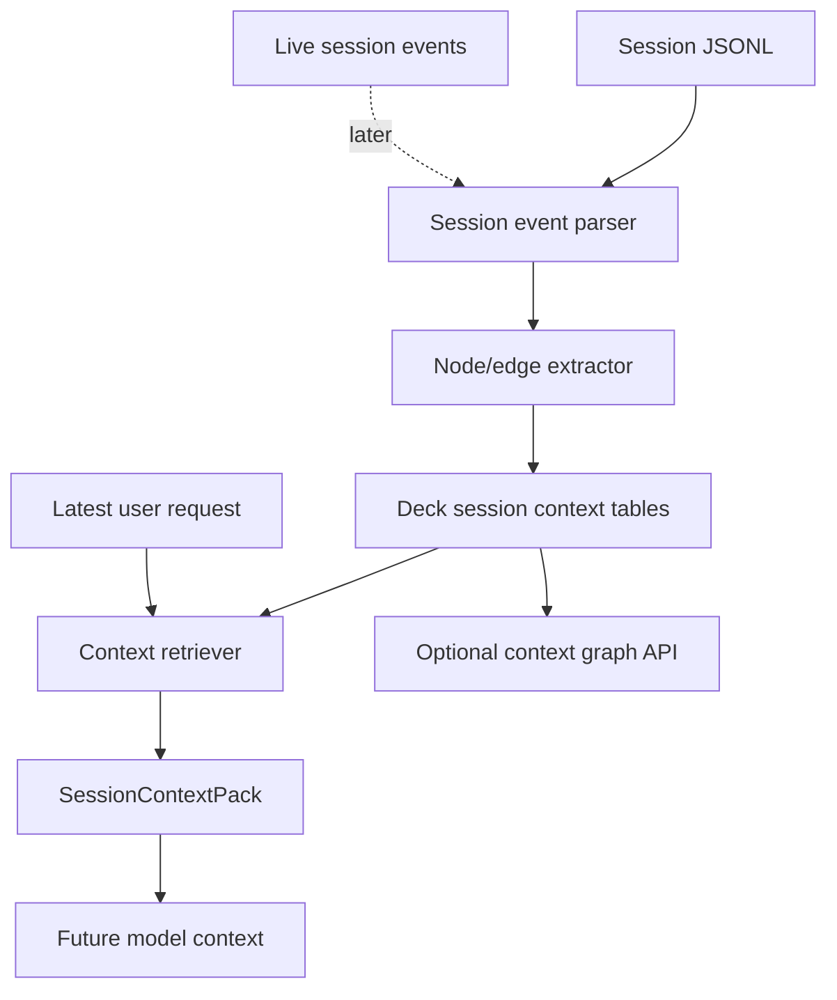

# Session Context Topology Design

## Problem

Long omp-deck sessions accumulate raw transcript, tool output, logs, reviews,
commits, browser smoke data, and user corrections. Replaying the whole session as
model context is expensive and noisy. The feature goal is not a graph UI first;
it is a replacement context layer: derive structured session memory from the
conversation and retrieve a compact context pack instead of feeding raw history.

## Goals

- Replace most raw transcript context with a compact, query-scoped context pack.
- Preserve task continuity: current goal, constraints, decisions, files, issues,
  fixes, verification, and remaining work.
- Keep raw message and artifact references so omitted detail can be recovered on
  demand.
- Store derived session context in deck-owned storage. Do not write to Mnemopi.
- Support historical rebuild from session JSONL before live incremental updates.
- Keep visualization optional. The first deliverable is retrieval quality and
  context reduction, not SVG polish.

## Non-goals

- No Cytoscape, React Flow, or graph visualization library.
- No writes to Mnemopi `working_memory`, `facts`, or `graph_edges`.
- No opaque LLM-only summary without source references.
- No full automatic replacement of every model prompt in the first slice.
- No embedding dependency in the first slice; lexical and structural retrieval
  comes first.

## Design summary

Add a deck-owned Session Context Graph. It parses session JSONL and live session
signals into typed nodes and dependency edges. Retrieval builds a bounded
`SessionContextPack` from the relevant subgraph for the latest user request.

The first implementation should be rebuild-first:

1. Parse an existing session JSONL file.
2. Extract deterministic nodes and edges.
3. Store them in deck DB tables.
4. Serve a compact context pack API.
5. Add tests proving important session facts survive compression.

Live incremental updates and UI can follow once the pack format is stable.

## Architecture



## Data model

### Tables

Names are illustrative; implementation should follow existing DB migration
patterns.

```sql
session_context_nodes (
  id TEXT PRIMARY KEY,
  session_id TEXT NOT NULL,
  kind TEXT NOT NULL,
  title TEXT NOT NULL,
  body TEXT NOT NULL,
  compressed_body TEXT NOT NULL,
  source_message_id TEXT,
  source_turn_index INTEGER,
  importance REAL NOT NULL DEFAULT 0.5,
  created_at TEXT NOT NULL,
  metadata_json TEXT NOT NULL DEFAULT '{}'
);

session_context_edges (
  id TEXT PRIMARY KEY,
  session_id TEXT NOT NULL,
  source_node_id TEXT NOT NULL,
  target_node_id TEXT NOT NULL,
  relation TEXT NOT NULL,
  weight REAL NOT NULL DEFAULT 1.0,
  evidence_message_id TEXT,
  metadata_json TEXT NOT NULL DEFAULT '{}'
);

session_context_artifacts (
  id TEXT PRIMARY KEY,
  session_id TEXT NOT NULL,
  node_id TEXT,
  kind TEXT NOT NULL,
  ref TEXT NOT NULL,
  label TEXT NOT NULL,
  metadata_json TEXT NOT NULL DEFAULT '{}'
);

session_context_checkpoints (
  session_id TEXT PRIMARY KEY,
  source_path TEXT NOT NULL,
  source_mtime_ms INTEGER NOT NULL,
  source_size_bytes INTEGER NOT NULL,
  node_count INTEGER NOT NULL,
  edge_count INTEGER NOT NULL,
  rebuilt_at TEXT NOT NULL
);
```

### Node kinds

| Kind | Meaning | Examples |
|---|---|---|
| `goal` | Active or historical user objective | “fix image lightbox”, “context replacement layer” |
| `user_intent` | User correction, approval, rejection, scope change | “not visualization; save context space” |
| `constraint` | Durable requirement inside the session | “do not write Mnemopi”, “no graph libs” |
| `decision` | Architecture or implementation choice | “deck-owned SQLite store” |
| `action` | Work performed | edit, test, deploy, inspect, review |
| `artifact` | File, commit, URL, test, log, image, API response | `apps/server/src/...`, commit hash |
| `issue` | Bug, failed test, review finding, user report | stale server, double data URL |
| `resolution` | Fix or mitigation | `DATA_IMAGE_URL_RE` path |
| `evidence` | Verification proof | test pass, typecheck, browser decode |
| `todo_state` | Open/completed task state | current remaining items |
| `handoff_summary` | Compressed summary over node set | generated continuation pack |

### Edge relations

| Relation | Direction | Meaning |
|---|---|---|
| `caused_by` | issue -> issue/decision/artifact | root cause link |
| `fixed_by` | issue -> resolution | fix link |
| `verified_by` | resolution -> evidence | proof link |
| `depends_on` | action/decision -> prerequisite | ordering dependency |
| `supersedes` | newer node -> older node | correction or replacement |
| `references_file` | node -> artifact | file dependency |
| `continues` | node -> prior node | task continuity |
| `contradicts` | correction -> obsolete assumption | user correction |
| `blocks` | issue -> goal/action | blocker |
| `summarizes` | summary -> covered node | compression provenance |

## APIs

### Rebuild context graph

```http
POST /api/sessions/:id/context/rebuild
```

Rebuilds derived context tables from the session JSONL. First version can be
manual or called when opening a session. It should be idempotent: delete and
replace derived rows for that session inside one transaction.

Response:

```ts
interface SessionContextRebuildResponse {
  sessionId: string;
  nodeCount: number;
  edgeCount: number;
  sourcePath: string;
  rebuiltAt: string;
}
```

### Retrieve context pack

```http
GET /api/sessions/:id/context-pack?q=&budget=4000
```

Returns a compact, query-scoped replacement context.

```ts
interface SessionContextPack {
  sessionId: string;
  query: string;
  budget: number;
  summary: string;
  goals: SessionContextNode[];
  constraints: SessionContextNode[];
  decisions: SessionContextNode[];
  issues: SessionContextNode[];
  resolutions: SessionContextNode[];
  artifacts: SessionContextArtifact[];
  evidence: SessionContextNode[];
  openTodos: SessionContextNode[];
  rawRefs: SessionContextRawRef[];
  omitted: {
    nodeCount: number;
    edgeCount: number;
    reason: string;
  };
}
```

### Inspect graph

```http
GET /api/sessions/:id/context-graph?limit=200
```

Optional inspection API for debugging and later UI. It must stay bounded.

## Extraction strategy

### Deterministic first pass

The first version should not depend on an LLM to understand every turn. Use
rules that preserve high-value context:

- User messages become `goal`, `user_intent`, or `constraint` candidates.
- Assistant final summaries become `handoff_summary` or `decision` candidates.
- Tool calls become `action` nodes with command/path/endpoint metadata.
- Tool outputs become `evidence` or `issue` nodes when they contain exit codes,
  failures, test counts, HTTP statuses, build SHAs, screenshot/browser decode
  facts, or reviewer verdicts.
- Todo snapshots become `todo_state` nodes.
- File paths, commit hashes, URLs, test names, route names, and symbols become
  artifacts or metadata.

### Compression

Use semantic compression rules for `compressed_body`:

- Delete filler and narration.
- Preserve negation, uncertainty, exact files, commands, counts, dates, hashes,
  API paths, user corrections, and verification outputs.
- Keep source message ids for recovery.
- Never compress away a user correction or a failed verification.

### Retrieval ranking

For `context-pack`, score nodes using:

1. Query term overlap with title/body/metadata.
2. Recency.
3. Importance by kind: user corrections, constraints, open issues, open todos,
   and verification evidence rank high.
4. Graph expansion from selected nodes through `fixed_by`, `verified_by`,
   `depends_on`, `supersedes`, and `contradicts`.
5. File/path/symbol exact matches.

The pack renderer should include high-priority sections first, then fit remaining
nodes into the requested budget. Initial budget handling can be character-based
with conservative token estimates.

## Context pack rendering

The pack should be usable directly as model context:

```text
CONTEXT_PACK
session: <id>
query: <latest user request>

GOAL
- ...

CURRENT_STATE
- ...

CONSTRAINTS
- ...

DECISIONS
- ...

FILES_AND_ARTIFACTS
- ...

ISSUES_AND_FIXES
- issue -> fix -> evidence

OPEN_TASKS
- ...

AVOID
- superseded assumptions / user corrections

RAW_REFS
- message ids / artifact refs for recovery
```

## Integration path

### Phase 1: service and tests

- Add protocol types for context nodes, edges, artifacts, graph, rebuild response,
  and context pack.
- Add deck DB migration for context tables.
- Implement JSONL parser and deterministic extractor.
- Add service tests with synthetic session JSONL.

Required cases:

- User correction supersedes previous design assumption.
- Failed test creates issue; later pass creates evidence; fix links both.
- File paths and commit hashes become artifacts.
- Open todos survive into context pack.
- Budgeted pack omits low-priority chatter but keeps constraints/evidence.

### Phase 2: routes and client API

- Add rebuild, context-pack, and bounded graph routes.
- Add web API methods.
- Keep routes read/derived relative to external memory systems.

### Phase 3: minimal UI/debug surface

- Add a small “Context Pack” debug panel in the current session UI or developer
  route.
- Show pack sections and raw refs.
- Do not block the backend value on graph visualization.

### Phase 4: live incremental update

- Subscribe to session events and update derived tables after turns.
- Keep rebuild as recovery/source of truth.

### Phase 5: prompt integration

- Use context pack as an explicit candidate replacement for raw transcript in
  future continuation/handoff flows.
- Add guardrails: raw transcript fallback when pack confidence or coverage is
  insufficient.

## Error handling

- Missing session JSONL: return 404 with clear message.
- Malformed JSONL lines: skip line, record extraction warning, continue.
- Unknown event shape: store minimal action/artifact only when safe.
- Oversized outputs: keep prefix/suffix and artifact reference, not whole output.
- Stale rebuild checkpoint: allow rebuild endpoint to refresh derived rows.

## Privacy and mutation boundaries

- Store only derived context from sessions already visible to deck.
- Do not write to Mnemopi memory tables.
- Do not invent facts during compression; every node keeps a source ref.
- Deleting a session should delete its derived context rows.

## Verification

Backend:

```sh
bun test apps/server/src/session-context-service.test.ts
bun run --filter '@omp-deck/server' typecheck
```

Web, once UI/API client is added:

```sh
bun run --filter '@omp-deck/web' typecheck
bun run --filter '@omp-deck/web' build
```

Manual smoke:

1. Pick a long existing session with user corrections, tests, and todos.
2. Rebuild context graph.
3. Request `context-pack` for a recent continuation query.
4. Confirm pack includes active goal, latest correction, files, evidence, and
   open tasks.
5. Confirm pack omits bulky raw tool output unless referenced.

## Open questions

1. First UI entry point: current chat session debug panel or Memory Cockpit tab.
   Recommendation: chat session first, because the context pack is session-bound.
2. Prompt integration boundary: expose pack for manual inspection first, then
   integrate into automatic continuation once quality is proven.
3. LLM extraction: defer until deterministic extraction has measurable gaps.
